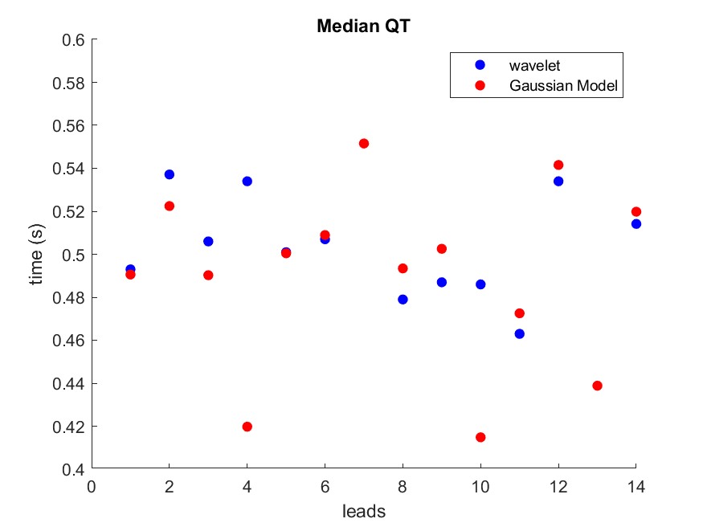

# Computerized QT-Interval Estimation: A Fusion of Multiple Machine-Based Annotators


The QT interval is measured based on a Gaussian model from Dr. Sameni and Mr. Fattahi: 

[D. Fattahi and R. Sameni, “Theoretical Performance Bounds of Model-Based Electrocardiogram Parameter Estimation,” preprint, Aug. 2021. doi: 10.36227/techrxiv.15176139.v2.] (https://www.techrxiv.org/articles/preprint/Theoretical_Performance_Bounds_of_Model-Based_Electrocardiogram_Parameter_Estimation/15176139).
Please add OSET's tools folder and Mr. Fattahi's QT folders to your matlab paths:


In addition, Dr. Li's wavelet method is used:
[T. Zhu, A. E. W. Johnson, J. Behar, and G. D. Clifford, “Bayesian voting of multiple annotators for improved QT interval estimation,” p. 4.](http://cinc.mit.edu/archives/2013/pdf/0659.pdf).

[T. Zhu, N. Dunkley, J. Behar, D. A. Clifton, and G. D. Clifford, “Fusing Continuous-Valued Medical Labels Using a Bayesian Model,” Ann. Biomed. Eng., vol. 43, no. 12, pp. 2892–2902, Dec. 2015, doi: 10.1007/s10439-015-1344-1.](https://drive.google.com/file/d/0B5wjNvhEV8-iVUxnbmJ2NV85T2s/view?resourcekey=0-MiMjnpPlULoUicGRQeOiOw).


## Installation instructions:
- clone Dr. Sameni's OSET:
```install
git clone https://github.com/alphanumericslab/OSET.git
```
- Add OSET's Tools folder to the Matlab path: addpath('C:\Users\you\yourFolder\yourFolder\OSET\Tools\')

- Add Mr. Fattahi's QT folder to Matlab path: addpath('C:\Users\you\yourFolder\yourFolder\OSET\UnderDevelopment\QTinterval');


- clone Dr. Li's from:  
```install 
git clone https://github.com/cliffordlab/QTestimation.git
```

- Add Dr. Qiao's QT estimator folder to Matlab path
addpath('C:\Users\you\yourFolder\yourFolder\QTestimation\QTestimation\QT_for_Alivecor\')

- To add the dataset you want QT measured in with the number of channels:
- Download the WFDB Software package from: (https://www.physionet.org/content/wfdb/10.6.2/)
- Install the WFDB toolbox by following instructions in: (https://archive.physionet.org/physiotools/matlab/wfdb-app-matlab/.)
- add the path and the number of channels in main_pipe.m , for example to add PTB database:

- dbPath = 'C:/Users/you/wfdb/database/ptbdb/';
- nChannels = 14; % number of channels to read
 
 - set results path:
results_path = 'C:\Users\you\yourFolder\yourFolder\QT_results';

### Requirements
This script was developed on a Windows machine with 7 core processor and 16 GB RAM. For the Physionet PTB database it took 22:25 hours to run.

## Description of scripts:
Once installed, the user can open the MATLAB script called main_pipe.m to run the QT measurements. 
 

## Results

The scripts will produce one scatter plot per patient's and sbuject's record in the results_path alogn with a CSV with QT measurments. To use QT measurment over all channels, please use  MedianQT_IQR_Lin_table and MedianQT_IQR_Fattahi_table. This variable measures the median QT interval in the interquartile range (between 1st nd 3rd interquartile to exclude outliers).

Below scatter plot shows the scatter plot of the two method of Dr. Lin's wavelet and Mr. Fattahi's Gaussian model for patient 1 (record s0014lre) of the PTB database:



## Contributor
[Sina Dabiri](https://github.com/Simurgh818)

